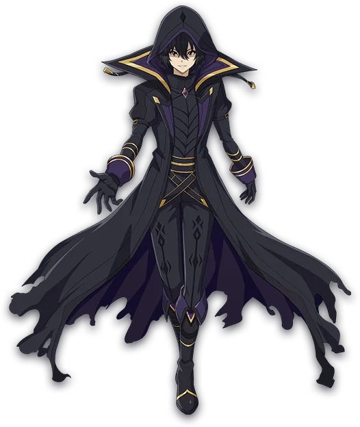
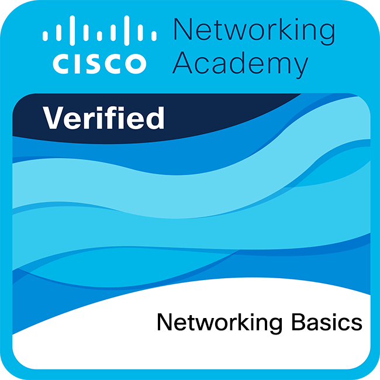
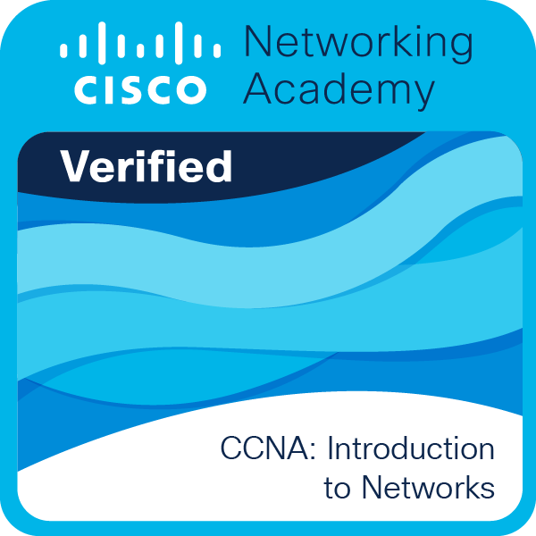
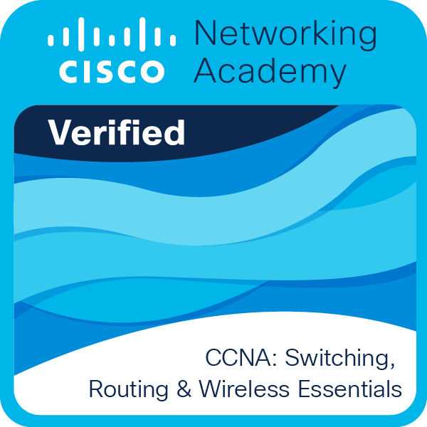

<div align="center">
    <a href="https://github.com/kawarimidoll/typograssy">
        
    </a>
    <p>
        
        <a href="https://t.me/yoshimakayaba">
            
        </a>
    </p>
</div>

<br>

<div align="center">
    
</div>

<br>

<h2 align="center"> 👁️‍🗨️ About me 👁️‍🗨️ </h2>

```zsh
john@keima: ~/my_readme (main⚡)$ neofetch
```



```csharp
My Profile ver. 6.0.0: 何も真実ではなく、すべてが許されているのでございます。
----------------------------------------------------------------------------------------
Username: Keima Tatsuya「桂馬達也」
WhoamI: Physicist. Programmer. Anime lover. Gamer. Musician.
Blog: When I have a domain I put it here.
OS: Arch Linux with KDE Plasma 6 Desktop Environment
Shell: zsh 5.9
Telegram: @yoshimakayaba. (You can contact me here :v)
Fav.Anime(1): 五等分の花嫁 (The Quintessential Quintuplets)💒📕👰🏻
Fav.Anime(2): からかい上手の高木さん (Karakai Jōzu no Takagi-san) 🏞️🚅🌠
Loves: Nakano_Itsuki (中野五月) ❤️ && Raphtalia (ラフタリア) 💘 
Pronouns: He/Him (彼/彼の)
Location: Planet Kepler-452b 🌍🪐✨
Languages: C/C++, Python, JavaScript, HTML, CSS, Bash, Shell Script. (Well sometimes I remember those languages :v) 
Learning: Js, React, Node.js, Vue.js, Django, ML, AI. (So much to learn and so little time :v)
FavouriteSong: Sweeter than wine by NCW
FavouriteEquation: Schrödinger && Shannon Entropy Equation
Hobbies: Programming, Watching anime, Playing videogames, Reading manga, Listening music, Learning new things. (I love to see the world with another point of view)
Languages.Learning: English (B1 ~ B2) || French (A2) || German (A1) || Japanese (N5 ~ N4)
Language.Speaks: Spanish (Native) || English (B2 ~ C1) || Japanese (N5 ~ N4)
My.Idols (アイドル): 高橋 李依 (Takahashi Rie) && 水瀬 いのり (Minase Inori) || 雨宮 天 (Amamiya Sora) || 佐倉 綾音 (Sakura Ayane) || ADO
Dansei.Seiyuu (男性声優): 松岡禎丞 (Matsuoka Yoshitsugu) || 山口光雄 (amaguchi Mitsuo) || 石川界人 (Ishikawa Kaito) 
Josei.Seiyuu (女性声優): 高橋李依 (Takahashi Rie) && 水瀬いのり(Minase Inori) || 瀬戸麻沙美 (Setō Asami)

```


<div>
    <br>
    <br>
    <br>
    <br>
    <p align="right">
        <a href = "https://www.youtube.com/watch?v=Sfz5TpCRSiI">
            
        </a>
       <b>ずっと真夜中でいいのに🎶「猫リセット」。🐱 ⏪<br><br></b>
    </p>
    <br>
    <br>
    <p align="right">
        <a href = "https://www.youtube.com/watch?v=ziZX0vy8xAM">
            
        </a>
        <b>奏(かなで)CV:高橋李依とCV:雨宮天<br>🎵ふたりはいつもどんな時もつながっていける。🎵</b>
    </p>
    <br>
    <br>
    <p align="left">
        <a href = "https://www.youtube.com/watch?v=oXlEEXws3gc">
            
        </a>
        <b><br><br>高橋李依🎶「共感されなくてもいいじゃない」。🎶🆙</b>
    </p>
    <br>
    <br>
    <p align="right">
        <a href="https://www.youtube.com/watch?v=jC97suFyObw">
            
        </a>
        <b><br>雨宮天🎶「ロンリーナイト・ディスコティック」。🎶💌</b></p>
    <br>
    <br>
    <p align="left">
    <a href="https://youtu.be/b_cuMcDWwsI?si=od4QcDPpNVk">
        
    </a>
    <b><br>かめりあ - ヒアソビ (feat. 初音ミク) 【Electroswing】💘🪄💕</b>
    </p>
</div>

<br>
<br>
<br>

<div>
    <h2 align="center"> 🔎Knowledge📖 </h2>
</div>
<div align = "center">
    <p align = "justify">
        I am a person passionate about technology and continuous learning. At the moment, I am strengthening my knowledge in networks and cybersecurity, studying CCNA and beginning with the fundamentals of CCNP. I am also starting to explore the field of Artificial Intelligence and Machine Learning, areas that excite me because of their impact on the future.
    </p>
    <p align = "justify">
        In the past, I worked with Jupyter Notebook for data analysis and artificial intelligence, applying graph theory to social networks. Today, I am focused on improving my skills in software development, even though I recognize that I am still in the process of growth.
    </p>
    <p align = "justify">
        Regarding programming, I have experience with C and C++, and I also use Python for projects related to analysis and automation. I work with JavaScript together with HTML and CSS for web development, and I rely on Bash and Shell Script for system administration and tasks in Linux environments.
    </p>
    <p align = "justify">
        My native language is Spanish, I am improving my English, and I am also studying Japanese with a level close to N4. I strive every day to improve in each area of specialization, convinced that continuous learning is the key to professional growth. My repositories reflect my progress and dedication.
    </p>
    <p align = "justify">
        In addition, I enjoy Japanese culture and I am a big fan of anime, which complements my interest in languages and technology.
        <br>
    </p>
    <br>
    <h2 align="center"> 💻 I've Worked With  </h2>
    <p align = "center">
         <a href="https://skillicons.dev">
             
        </a>
    </p>
    <h2 align="center"> 🛠️ I'm still learning or working on  </h2>
    <p align = "center">
         <a href="https://skillicons.dev">
             
        </a>
    </p>
</div>
<br>
<br>
<br>

<div>
    <h2 align = "center"> 🏆 My Badges </h2>
</div>
<div align="center">
    
    
    
    
    
    
    
</div>
<br>
<br>
<br>

<h2 align = "center"> 📉 GitHub Stats</h2>
<div> 
    <p align = "center">
<!--         <a href="https://github-readme-stats.vercel.app">
            
        </a> -->
        <a href="https://github-readme-streak-stats.herokuapp.com">
            
        </a><!--change language to japanese locale=jp-->
<!--         <a href="https://github.com/ryo-ma/github-profile-trophy">
            
            
        </a> -->
        <a href="https://github.com/ashutosh00710/github-readme-activity-graph">
            
        </a>
        <a href="https://github.com/vn7n24fzkq/github-profile-summary-cards">
            
    </p>
</div>
<br>
<br>
<h1 align="center"> My contributions game 🐍🎮</h1>


<br>

<h2 align ="center"> 📝 Contact me 📝</h2>
<br> 
<div align="center">
    <a href="https://github.com/JohnKun136NVCP" target="_blank">
        
    </a>
    <a href="https://twitter.com/JohnWilliamBn" target="_blank">
        
    </a>
    <a href="https://linkedin.com/in/juan-ang-1307191b0" target="_blank">
        
    </a>
    <br>
    
</div>  
<br>
<div>
    <h2 align="center">Thank you for reading 🙋🏻‍♂️</h2>
    <div align="center">
        
    </div>
</div>
<br> 
<br>

    
<h1 align="center">Support Me 🎧🎤  </h1>

<p align="center">
      
⠀⠀⠀⠀⠀
</p>


<a href="https://www.buymeacoffee.com/johnkun29" target="_blank"></a>
